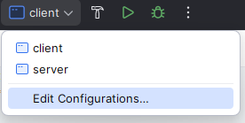
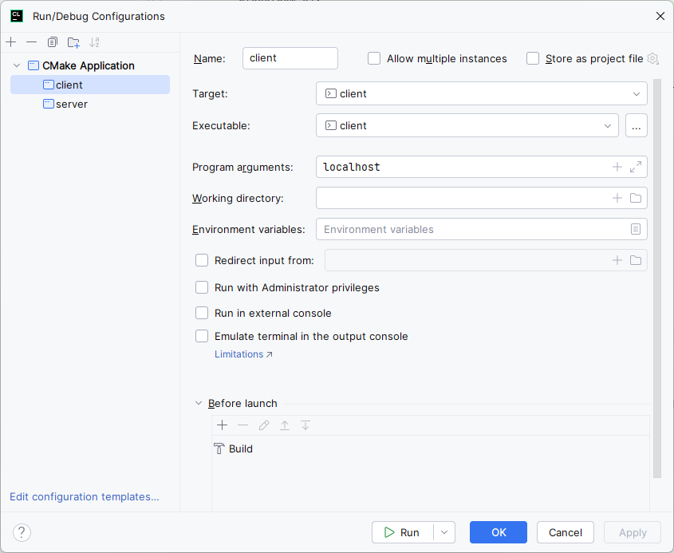
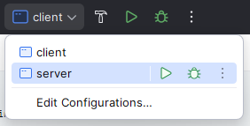
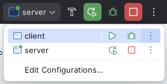
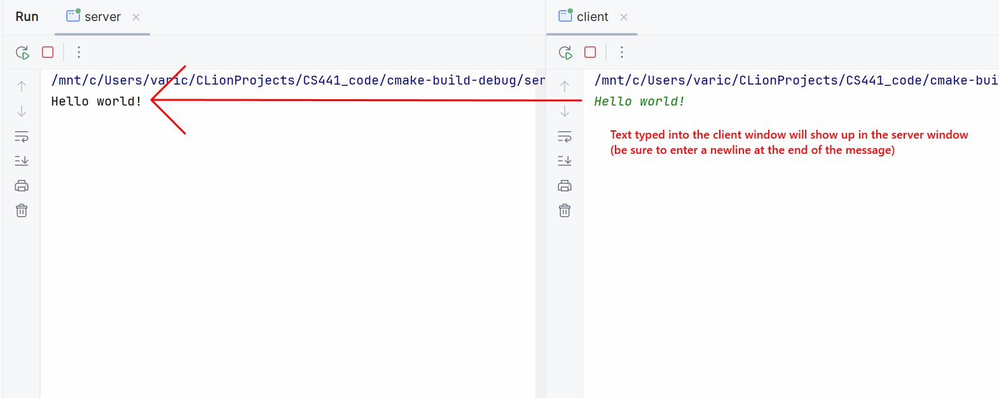
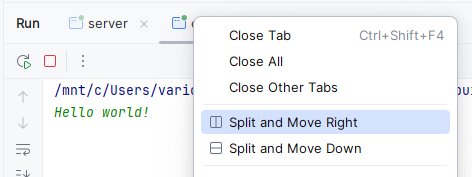

# 1.4.2 Example Application

> Example and text from **Computer Networks - A Systems Approach 6-1** by Peterson and Davie.
> 
> CLion run instructions by Varick Erickson

We now show the implementation of a simple client/server program that
uses the socket interface to send messages over a TCP connection. The
program also uses other Linux networking utilities, which we introduce as
we go. Our application allows a user on one machine to type in and send
text to a user on another machine. It is a simplified version of the
Linux ``talk`` program, which is similar to the program at the core of
instant messaging applications.

## Client

We start with the client side, which takes the name of the remote
machine as an argument. It calls the Linux utility to translate this name
into the remote host’s IP address. The next step is to construct the
address data structure (`sin`) expected by the socket interface.
Notice that this data structure specifies that we’ll be using the socket
to connect to the Internet (`AF_INET`). In our example, we use TCP
port 5432 as the well-known server port; this happens to be a port that
has not been assigned to any other Internet service. The final step in
setting up the connection is to call `socket` and `connect`. Once
the operation returns, the connection is established and the client
program enters its main loop, which reads text from standard input and
sends it over the socket.

```c++
   #include <stdio.h>
   #include <sys/types.h>
   #include <sys/socket.h>
   #include <netinet/in.h>
   #include <netdb.h>
   #include <stdlib.h>
   #include <unistd.h>
   #include <string.h>

   #define SERVER_PORT 5432
   #define MAX_LINE 256

   int
   main(int argc, char * argv[])
   {
     FILE *fp;
     struct hostent *hp;
     struct sockaddr_in sin; // sin -> Socket Internet
     char *host;
     char buf[MAX_LINE];
     int s;
     int len;

     if (argc==2) {
       host = argv[1];
     }
     else {
       fprintf(stderr, "usage: simplex-talk host\n");
       exit(1);
     }

     /* translate host name into peer's IP address */
     hp = gethostbyname(host);
     if (!hp) {
       fprintf(stderr, "simplex-talk: unknown host: %s\n", host);
       exit(1);
     }

     /* build address data structure */
     bzero((char *)&sin, sizeof(sin));
     sin.sin_family = AF_INET;
     bcopy(hp->h_addr, (char *)&sin.sin_addr, hp->h_length);
     sin.sin_port = htons(SERVER_PORT);

     /* active open */
     if ((s = socket(PF_INET, SOCK_STREAM, 0)) < 0) {
       perror("simplex-talk: socket");
       exit(1);
     }
     if (connect(s, (struct sockaddr *)&sin, sizeof(sin)) < 0)
     {
       perror("simplex-talk: connect");
       close(s);
       exit(1);
     }
     /* main loop: get and send lines of text */
     while (fgets(buf, sizeof(buf), stdin)) {
       buf[MAX_LINE-1] = '\0';
       len = strlen(buf) + 1;
       send(s, buf, len, 0);
     }
   }
```

## Server

The server is equally simple. It first constructs the address data
structure by filling in its own port number (`SERVER_PORT`). By not
specifying an IP address, the application program is willing to accept
connections on any of the local host’s IP addresses. Next, the server
performs the preliminary steps involved in a passive open; it creates
the socket, binds it to the local address, and sets the maximum number
of pending connections to be allowed. Finally, the main loop waits for a
remote host to try to connect, and when one does, it receives and prints
out the characters that arrive on the connection.

```c++

#include <stdio.h>
#include <sys/types.h>
#include <sys/socket.h>
#include <netinet/in.h>
#include <netdb.h>
#include <stdlib.h>
#include <unistd.h>
#include <string.h>

#define SERVER_PORT  5432
#define MAX_PENDING  5
#define MAX_LINE     256

int main()
{
    struct sockaddr_in sin;  // sin -> Socket Internet
    char buf[MAX_LINE];
    int buf_len;
    socklen_t addr_len;
    int s, new_s;

     /* build address data structure */
     bzero((char *)&sin, sizeof(sin));
     sin.sin_family = AF_INET;
     sin.sin_addr.s_addr = INADDR_ANY;
     sin.sin_port = htons(SERVER_PORT);

     /* setup passive open */
     if ((s = socket(PF_INET, SOCK_STREAM, 0)) < 0) {
       perror("simplex-talk: socket");
       exit(1);
     }
     if ((bind(s, (struct sockaddr *)&sin, sizeof(sin))) < 0) {
       perror("simplex-talk: bind");
       exit(1);
     }
     listen(s, MAX_PENDING);

    /* wait for connection, then receive and print text */
     while(1) {
       if ((new_s = accept(s, (struct sockaddr *)&sin, &addr_len)) < 0) {
         perror("simplex-talk: accept");
         exit(1);
       }
       while (buf_len = recv(new_s, buf, sizeof(buf), 0))
         fputs(buf, stdout);
       close(new_s);
     }
}
```
## Running the Example
You will need to be running a linux compiler for this example.  If you are trying to run this example in Windows, then
you could use WSL with a distribution such as Ubuntu or Debian.

### Step 1: Set Up the Client Run Configuration
The client requires you to connect to a server that is specified as a command line argument.  You can specify this
argument by editing the run configuration of the client program. 

Click the **Edit Confirgurations** under the Run/Debug dropdown



Under the **Program arguments** write the IP address of your server.  If ther server is running on the same machine as 
the client, then you can use **localhost** as the argument.



### Step 2: Start the server
You will first need to start the server.



### Step 3: Run the client



The client will behave like a one-way chat window.  Any text entered into the client will show up in server.



> ### HINT: 
> You may find it helpful to split and move right/down to see both program windows.
> 

# Socket Address Structs

```c++
struct in_addr {
    uint32_t s_addr;   /* IPv4 address, network byte order */
};

// IPv4
struct sockaddr_in {
    short   sin_family;       /* = AF_INET */
    u_short sin_port;         /* = htons (PORT) */
    struct  in_addr sin_addr; /* IPv4 address */
    char    sin_zero[8];      /* unused padding */
} sin;


struct in6_addr {
    unsigned char s6_addr[16];
};

// IPv6
struct sockaddr_in6 {
    sa_family_t     sin6_family;   /* AF_INET6 */
    in_port_t       sin6_port;     /* port number (network byte order) */
    uint32_t        sin6_flowinfo; /* IPv6 flow information */
    struct in6_addr sin6_addr;     /* IPv6 address */
    uint32_t        sin6_scope_id; /* Scope ID (for link-local addresses) */
};

...

// Code to use the Daytime protocol (RFC867)
// Historically used to ask a server for the current date and time
int s = socket (AF_INET, SOCK_STREAM, 0);
bzero (&sin, sizeof (sin));
sin.sin_family = AF_INET;
sin.sin_port = htons (13);        /* daytime port */
sin.sin_addr.s_addr = htonl (IP_ADDRESS);
connect (s, (sockaddr *) &sin, sizeof (sin));
while ((n = recv(s, buf, sizeof(buf), 0)) > 0)
    write(1, buf, n);
```

# Handling Address Types


## Byte Order

Networks use a standard byte order called network byte order, which is **big
endian**. A machine may use a different byte order (often little
endian), so values must be converted.

> ### Big vs Little Endian
> * Little Endian: Stores least significant byte in the lowest address
> * Big Endian: Stores the most significant byte in the highest address
>
> ### TLDR  
> If you don't convert properly, you will be reading/writing bytes in the 
> wrong order.

The following struct fields are in network byte order (Big Endian)
* `sin_port` (IPv4) 
* `sin_port6` (IPv6)
* `sin_addr.s_addr`  (IPv4)
* `sin6_addr` (IPv6)

## `htonl()` Host to Network, 32 bits
Used to convert a 32-bit value from host byte order to network byte order (big endian).
### Example
```c++
sin.sin_addr.s_addr = htonl (IP_ADDRESS);  // Store 32 bit address in network format 
```

## `htons()`: Host to Network, 16 bits
Used to convert a 16-bit value from host byte order to network byte order (big endian).
### Example
```cpp
sin.sin_port = htons (13);  // Store 16 bit port in network format
```

## `ntohl()` Network to Host, 32 bits
Used to convert a 32-bit value from network byte order (big endian) to host byte order.
### Example
```c++
uint32_t ip = ntohl(sin.sin_addr.s_addr);
```

## `ntohs()`: Network to Host, 16 bits
Used to convert a 16-bit value from network byte order (big endian) to host byte order.
### Example
```c++
u_short port = ntohl(sin.sin_port);
```

* 
* Remember to always convert!
All address types begin with family
sa_family in sockaddr tells you actual type
Not all addresses are the same size
e.g., struct sockaddr_in6 is typically 28 bytes, yet generic  struct sockaddr is only 16 bytes
So most calls require passing around socket length
New sockaddr_storage is big enough
